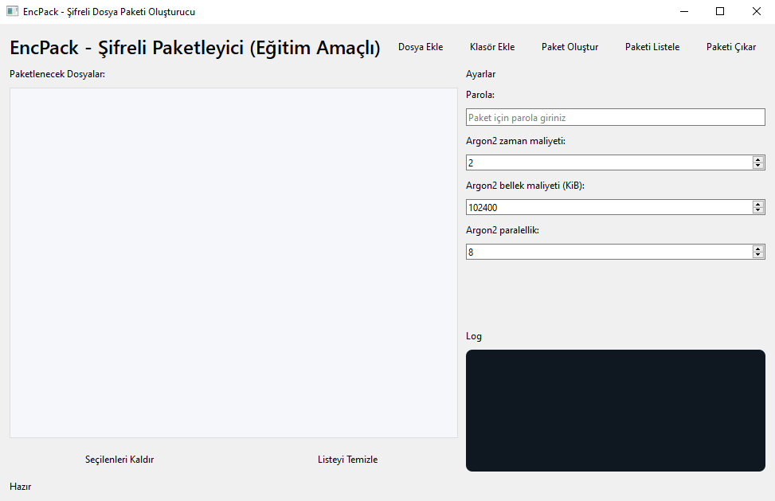

<h1>🚀 ebs-encrypted-archive</h1>

<strong>ebs-encrypted-archive</strong>, güçlü ve kolay kullanımlı bir <strong>şifreli dosya paketleyici</strong>dir. Python ve PySide6 ile geliştirilmiş olup, Argon2 tabanlı anahtar türetme ve AES-GCM ile güvenli şifreleme sağlar. Dosya ve klasörleri güvenli şekilde paketleyip, parola korumalı olarak arşivler.

<h2>📦 Nedir? Ne İşe Yarar?</h2>

<code>ebs-encrypted-archive</code>, dosya ve klasörlerinizi tek bir şifreli paket halinde toplamanıza ve güvenle saklamanıza olanak verir. Böylece:

<ul>
<li>Dosyalarınızın gizliliğini korur.</li>
<li>Parola olmadan içeriklere erişilemez.</li>
<li>Çok büyük dosyaları parçalar halinde şifreler.</li>
<li>Güçlü Argon2 ile anahtar türetme ile parola güvenliğini artırır.</li>
<li>AES-GCM algoritması ile hem şifreler hem veri bütünlüğünü sağlar.</li>
</ul>

<h2>⚙️ Özellikler</h2>

<ul>
<li>Dosya ve klasör bazlı paketleme (alt klasörler dahil).</li>
<li>Parola ile güçlü şifreleme (Argon2 + AES-GCM).</li>
<li>Paket içeriğini listeleme.</li>
<li>Paketi şifreli şekilde çıkarma.</li>
<li>Çoklu dosya ve büyük dosya desteği (chunk bazlı).</li>
<li>GUI tabanlı kolay kullanım (PySide6).</li>
<li>İşlem sırasında arayüz donmasını önleyen thread yapısı.</li>
<li>Parola girişinde gizlilik (şifre maskelenir).</li>
<li>Argon2 parametrelerinin (zaman, bellek, paralellik) ayarlanabilmesi.</li>
<li>Platformlar arası uyumluluk (Windows, Linux, macOS).</li>
</ul>

<h2>💻 Desteklenen İşletim Sistemleri</h2>

<ul>
<li>Windows 10 ve üstü</li>
<li>Linux dağıtımları (Ubuntu, Fedora, Debian, vs.)</li>
<li>macOS (modern sürümler)</li>
</ul>

<h2>📸 Ekran Görüntüsü</h2>

<h2>🚀 Kurulum</h2>

<ol>
<li><strong>Python 3.9 veya üzeri</strong> kurulu olduğundan emin olun.</li>
<li>Gerekli bağımlılıkları yükleyin:</li>
</ol>

<pre><code>pip install PySide6 cryptography argon2-cffi
</code></pre>

<h2>🛠️ Kullanım</h2>

<h3>Programı çalıştırmak için:</h3>

<pre><code>python ebs_secure_pack.py
</code></pre>

<h3>Özellikler:</h3>

<ul>
<li><strong>Dosya Ekle:</strong> Paketlemek istediğiniz dosyaları seçin.</li>
<li><strong>Klasör Ekle:</strong> Alt klasörler dahil tüm dosyaları seçilen klasörden ekleyin.</li>
<li><strong>Paket Oluştur:</strong> Seçilen dosyaları parola ile şifreleyip tek bir <code>.encpack</code> dosyası oluşturur.</li>
<li><strong>Paketi Listele:</strong> Var olan <code>.encpack</code> dosyasının içeriğini görüntüler.</li>
<li><strong>Paketi Çıkar:</strong> Parola girerek şifreli paketi belirtilen klasöre açar.</li>
</ul>

<h2>⚙️ Argon2 Parametreleri Açıklaması</h2>

<ul>
<li><strong>Zaman Maliyeti (time_cost):</strong> Hesaplama kaç kere yapılacak (daha yüksek → daha güvenli ve yavaş).</li>
<li><strong>Bellek Maliyeti (memory_cost):</strong> Kullanılacak bellek miktarı (KiB cinsinden, yüksek değer → daha güvenli).</li>
<li><strong>Paralellik (parallelism):</strong> Paralel iş parçacığı sayısı (çok çekirdekli işlemciler için optimize).</li>
</ul>

Varsayılan değerler performans ve güvenlik arasında iyi bir denge sağlar.

<h2>🔒 Güvenlik Avantajları</h2>

<ul>
<li><strong>Güçlü parola tabanlı anahtar türetme:</strong> Argon2 ID tipi ile parola kırılmaya karşı dayanıklıdır.</li>
<li><strong>AES-GCM:</strong> Hem şifreleme hem veri bütünlüğü sağlar (veri değiştirilirse açma işlemi başarısız olur).</li>
<li><strong>Her dosya için benzersiz nonce (ilk vektör):</strong> Tekrarlanan saldırılara karşı direnç.</li>
<li><strong>Chunk tabanlı şifreleme:</strong> Büyük dosyaların güvenli ve etkili paketlenmesi.</li>
<li><strong>Parola olmadan dosya içeriği tamamen gizli kalır.</strong></li>
</ul>

<h2>📄 Lisans</h2>

Bu proje <strong>Apache License 2.0</strong> ile lisanslanmıştır. Daha fazla bilgi için <code>LICENSE</code> dosyasına bakabilirsiniz.

<h2>🤝 Katkıda Bulunma</h2>

Katkılarınızı memnuniyetle karşılarız! İsterseniz:

<ul>
<li>Hata bildirimi,</li>
<li>Yeni özellik önerisi,</li>
<li>Kod geliştirme</li>
</ul>

yapabilirsiniz. 

<h2>🧑‍💻 Yazar</h2>

<strong>ebubekir bastama</strong> (ebs) 
<a href="https://github.com/ebubekirbastama">GitHub Profiliniz</a>

<h2>💬 İletişim</h2>

Sorularınız için <a href="mailto:ebubekiryazilim@gmail.com">EBSMail Adresi</a> adresinden bana ulaşabilirsiniz.

⭐️ Eğer bu projeyi faydalı bulduysanız, bir ⭐ bırakmayı unutmayın!

